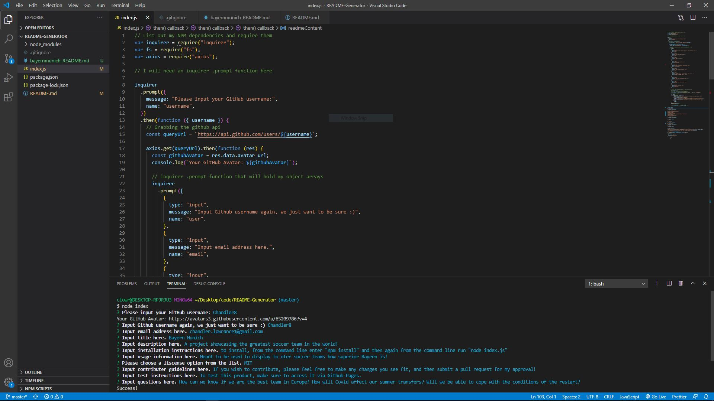
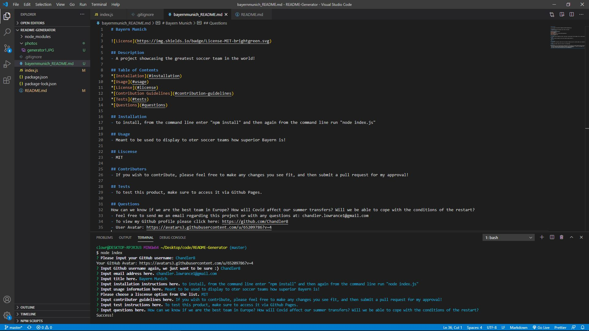

# README Generator


The following is a command line application that allows users to dynamically generate a README.md file. If the user finds themselves unsure about what a properly formatted README should look and flow like, then this is the perfect app for them. Within this app you will find Node.js, NPM modules, Axios, Inquirer, and others. By eliminating the hassle of trying to properly format and remember all of the different categories involved with creating a README, this app will give users more time to focus on the quality of their products!

## Features

A few of the things you can do with README Generator:

* Input your unique information into the CLI to generate README's tailored to your needs.
* Please see the bayernmunich_README.md file within the repository to view a generated README example.
* Easily create a README that covers every important subcategory of headers including:
```
Title
Description
Installation
Usage
Liscense
Contributors
Tests
Questions
```

## User Story

```
AS A developer
I WANT a README generator
SO THAT can quickly create a professional README for a new project
```

## Table of Contents


* [Installation](#installation)
* [License](#license)
* [Questions](#questions)
* [Contributors](#contributors)
* [Images](#images)

# Installation

Before you run this application, please enter into your terminal:
- npm install

After you have done this, to run the application, please enter into your terminal: 
- node index.js

# License

Application working under an MIT license

# Questions

Reach out to me via email regarding any questions or concerns with this project:
- chandler.lowrance1@gmail.com


# Contributors

| Chandler
------------ 

[<br /><sub><b>Chandler Lowrance</b></sub>](https://github.com/Chandler8)<br />[💻](https://github.com/Chandler8?tab=repositories "Repositories")

# Images




